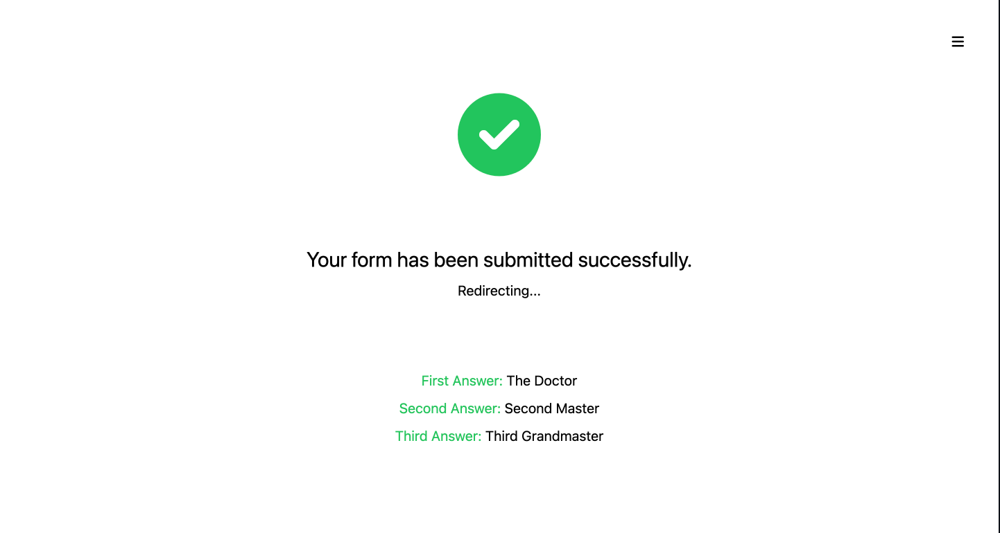

# Build Appeal Multi Form

> This is a multi-form Nextjs application. It is a simple way to build a multi-form with Nextjs. The form uses tailwindCSS for styling and Formik for handling form fields and submisson. In this example, the form is a simple radio button form. However if the form is more complex, it can be built with adding formik field values. Then it would make sense to use validation for the form as well. Yup library would be a great option to add validation. 
## Live Demo

[Demo link](https://build-appeal-kappa.vercel.app/)
## Landing Page


## Navbar


## Form Steps


## Success


## Built With

- Tailwind CSS
- React
- Nextjs
- Formik

## Getting Started

To get a local copy up and running follow these simple example steps.

### Setup

Run

```bash
# To clone the git repositories
git clone https://github.com/uzairali19/scroll-quiz.git

# To install dependencies
yarn

# To run development branch
yarn dev

# To build the project
yarn build

# To run tests on the project
yarn lint
```

## Authors

👤 **Uzair Ali**

- GitHub: [@uzairali19](https://github.com/uzairali19)
- Twitter: [@uzairali751](https://twitter.com/Uzairali751)
- LinkedIn: [Uzair Ali](https://www.linkedin.com/in/uzairali19/)

## 🤝 Contributing

Contributions, issues, and feature requests are welcome!

Feel free to check the [issues page](https://github.com/uzairali19/scroll-quiz/issues/).

## Show your support

Give a ⭐️ if you like this project!

## Acknowledgments

- Inspiration: [Airbnb Trip Matcher](https://news.airbnb.com/tripmatcher)

## 📝 License

This project is [MIT](./MIT.md) licensed.